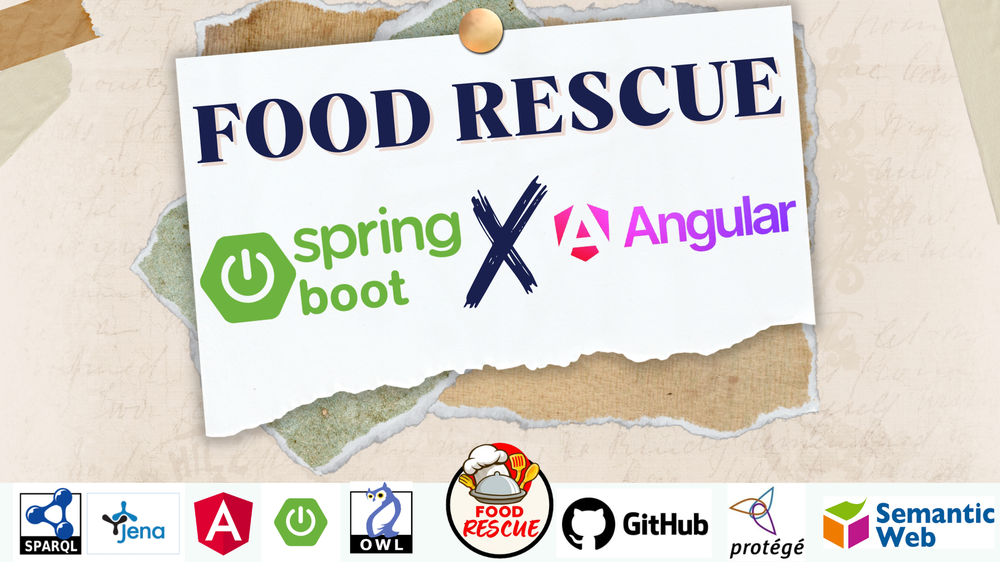

# Food Rescue



Food Rescue is a web application designed to facilitate the recovery of surplus food from restaurants and retailers, as well as its redistribution to charitable organizations. This project includes a backend developed with Spring and a frontend built with Angular.

We also worked with Protégé to create object properties, data properties, and individuals. Additionally, we worked on the ontology, RDF and OWL files, and SPARQL queries.

Here is the link to the presentation: [Presentation Link](https://www.canva.com/design/DAGR5eSLDyU/yvH2xbPooPlCQK5dOvx0tg/edit?utm_content=DAGR5eSLDyU&utm_campaign=designshare&utm_medium=link2&utm_source=sharebutton)

## Features

The application offers the following features:

- **Director Management**: Addition, updating, and deletion of directors.
- **Association Management**: Administration of charitable organizations involved in food collection.
- **Restaurant Management**: Registration and management of restaurants participating in surplus recovery.
- **Food Management**: Tracking of available food types and their condition.
- **Inventory Management**: Monitoring of recovered food stocks.
- **Feedback**: Collection of user experience feedback.
- **Notifications**: Sending notifications for collection events.
- **Collection Events**: Organization and management of collection events.

## Technologies Used

- **Backend** : Spring Framework
- **Frontend** : Angular
- **Ontology Management** : Apache Jena

### Prerequisites
Before you begin, make sure you have the following installed on your machine:

- JDK 11 or higher
- Node.js and npm
- Maven

### Installation Instructions

1. **Clone the repository** :
   ```bash
   git clone https://github.com/votre-utilisateur/food-rescue.git
   cd food-rescue
   ```
2. **Install the backend and Start the server: :** :
   ```bash
   cd backend
   mvn install
   mvn spring-boot:run
   ```
3. **Install the frontend and Start the frontend server :** :
   ```bash
   cd frontend
   npm install
   ng serve -o
   ```

## Contributors

The following individuals contributed to the development of RescueFood:

- Mohamed Wassim Ennar
- Nidhal Ennar
- Said Atoui
- Ahmed Gamgami
- Chaima Idoudi

## Contact

For further details or contributions, please feel free to contact the contributors


